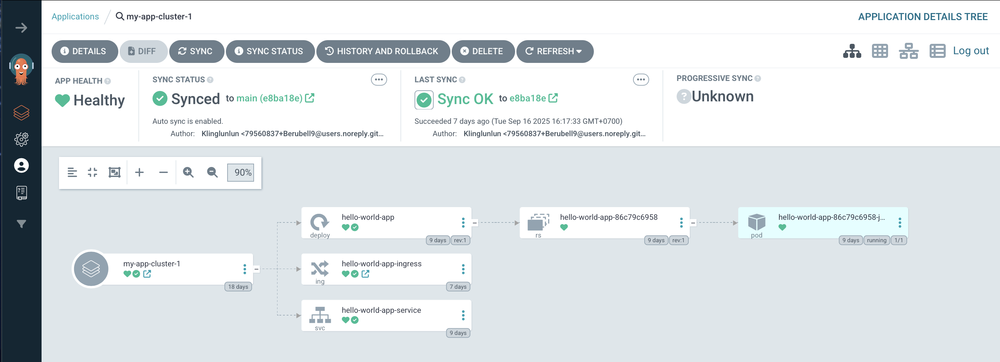

# วิธีเอา Application เข้า ArgoCD
notion : https://www.notion.so/ArgoCD-25643a38c84a8030a733dcd8ae857b42?source=copy_link

1. ติดตั้ง ArgoCD
    
    1.1 สร้าง namespace ชื่อ argocd

    ```base
    k0s kubectl create namespace argocd
    ```

    1.2 ติดตั้ง ArgoCD ลง namespace

    ```base
    k0s kubectl apply -n argocd -f https://raw.githubusercontent.com/argoproj/argo-cd/stable/manifests/install.yaml
    ```
    1.3 ติดตั้ง ArgoCLI

    ```base
    curl -sSL -o argocd-linux-amd64 https://github.com/argoproj/argo-cd/releases/latest/download/argocd-linux-amd64

    sudo install -m 555 argocd-linux-amd64 /usr/local/bin/argocd

    rm argocd-linux-amd64
    ```

    1.4 เข้าถึง ArgoCD API
    ```base
    k0s kubectl edit svc argocd-server -n argocd
    ```
    เข้าไปเปลี่ยน Type ใน service ชื่อ argocd-server จาก "LoadBalance" เป็น "NodePort"
    
    หรือ
    ```base
    k0s kubectl get svc argocd-server -n argocd -o=jsonpath='{.status.NodePort.ingress[0].ip}'
    ```

    1.5 เปิดเว็บ ArgoCD ด้วย
    
    `<external ip>:(port 80 ของ service ชื่อ argocd-server)`

2. เข้าสู่ระบบของเว็บ ArgoCD UI

    2.1 ดึงรหัสผ่านเริ่มต้นสำหรับ admin จาก secret ของ ArgoCD

    ```base
    k0s kubectl -n argocd get secret argocd-initial-admin-secret -o jsonpath="{.data.password}" | base64 --decode
    ```

    2.2 Login argoCD

    ```base
    argocd login <external ip>:(port 80 ของ service ชื่อ argocd-server)
    ```
    ใส่ทั้งในเว็บ เเละCLI
    ```base
    Username : admin
    Password : Yw0PT7ykm8JpjlDK
    ```

3. เชื่อม Git repository เข้ากับ ArgoCD UI

4. Deploy application
    
    4.1 สร้างไฟล์ชื่อ AppOfApp.yaml
    ```yaml
    apiVersion: argoproj.io/v1alpha1
    kind: Application
    metadata:
        name: applications
        namespace: argocd
    spec:
        project: default
        source:
            repoURL: https://github.com/Berubell9/web-app-project-gitops.git
            targetRevision: beginner
            path: project/manifest
        destination:
            server: https://kubernetes.default.svc
            namespace: default
        syncPolicy:
            automated:
                prune: true
                selfHeal: false
    ```
    4.2 ใช้คำสั่ง kubectl apply เพื่อ deploy แอปลง Kubernetes (Pods)
    ```basei
    k0s kubectl apply -f AppOfApp.yaml
    ```

    4.3 ภายในโฟลเดอร์ manifest ต้องมีไฟล์มั้งหมด 3 ไฟล์ ได้เเก่
    - app-deployment.yaml
    - app-ingress.yaml
    - app-service.yaml

# ผลลัพธ์

